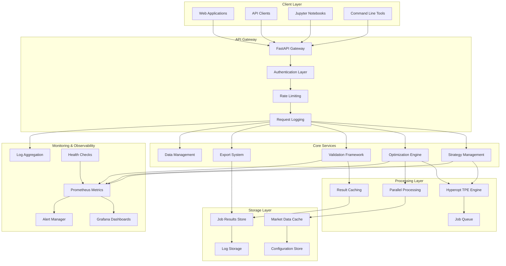
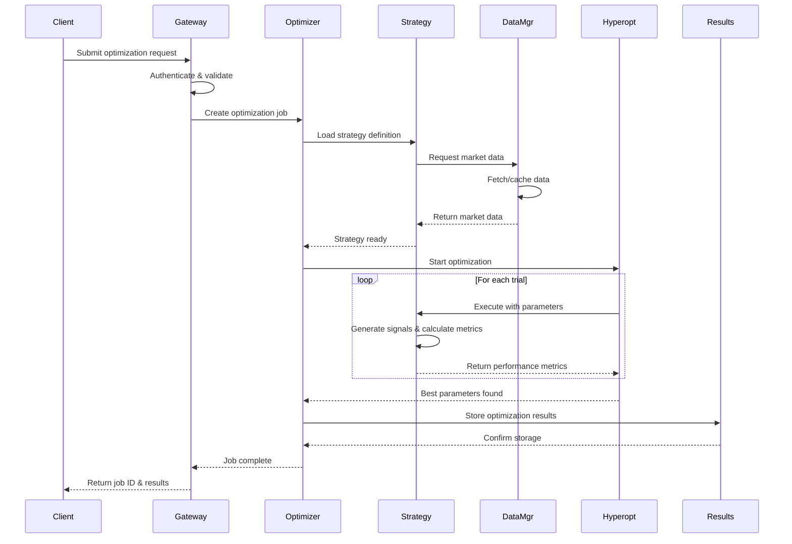
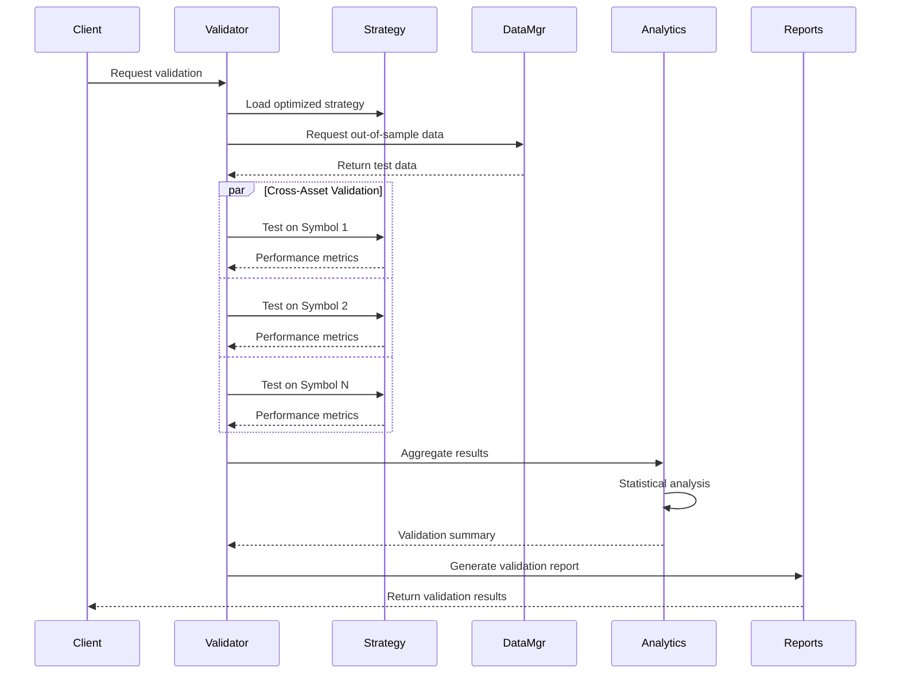
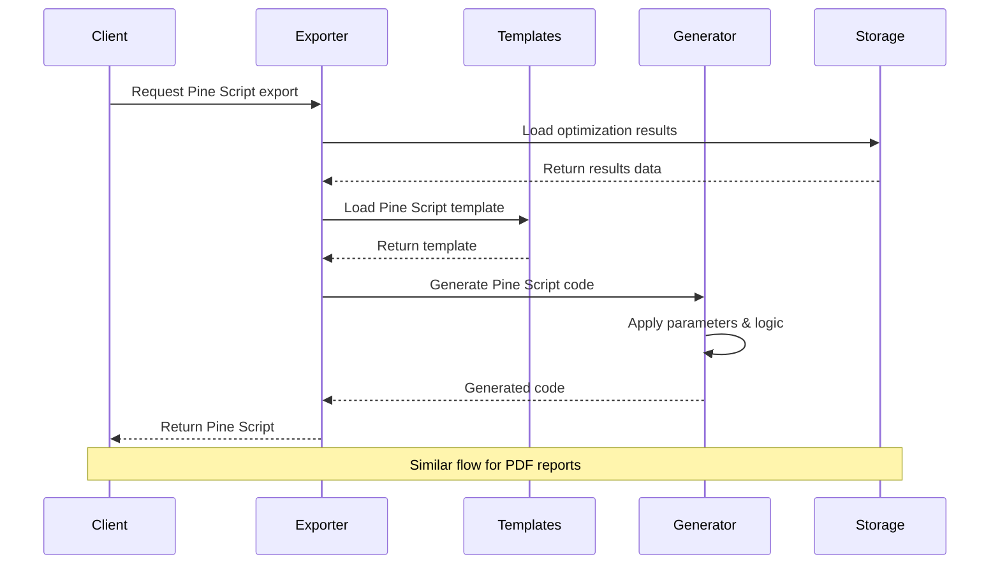

# 🏗️ System Architecture Overview

## Complete System Design & Component Architecture

This document provides a comprehensive overview of the Trading Strategy Optimization System architecture, including all major components, data flows, and design decisions.

---

## 🎯 **High-Level Architecture**



---

## 📊 **Component Overview**

### **1. API Gateway Layer**

The entry point for all client interactions, providing a unified interface to the system's capabilities.

#### **FastAPI Gateway**
- **High-performance async web framework**
- **Automatic API documentation** (OpenAPI/Swagger)
- **Request/response validation** with Pydantic models
- **WebSocket support** for real-time updates

#### **Authentication & Security**
- **API Key-based authentication** with configurable keys
- **Rate limiting** to prevent abuse and ensure fair usage
- **CORS configuration** for web client support
- **Request validation** and sanitization

#### **Request Processing**
- **Structured logging** of all API interactions
- **Error handling** with detailed error responses
- **Response caching** for frequently accessed data
- **Async processing** for long-running operations

### **2. Core Business Services**

The heart of the system, implementing all trading strategy optimization logic.

#### **Strategy Management Service**
```python
# Key responsibilities:
- Strategy registration and discovery
- Parameter space definition and validation
- Strategy metadata management
- Signal generation coordination
```

**Key Features:**
- **65+ pre-built strategies** across multiple categories
- **Dynamic strategy loading** from configuration
- **Parameter validation** and constraint checking
- **Strategy performance caching**

#### **Optimization Engine**
```python
# Key responsibilities:
- Hyperparameter optimization coordination
- Trial execution and result collection
- Progress tracking and reporting
- Optimization algorithm selection
```

**Key Features:**
- **Hyperopt TPE algorithm** for intelligent parameter search
- **Multi-objective optimization** balancing multiple metrics
- **Parallel trial execution** across CPU cores
- **Real-time progress monitoring** with WebSocket updates

#### **Validation Framework**
```python
# Key responsibilities:
- Out-of-sample testing coordination
- Cross-asset validation execution
- Statistical significance testing
- Performance metric calculation
```

**Key Features:**
- **Walk-forward analysis** with configurable windows
- **Monte Carlo simulation** for robustness testing
- **Cross-validation** with time-aware splits
- **Regime analysis** across market conditions

#### **Export System**
```python
# Key responsibilities:
- Pine Script v5 code generation
- PDF report creation with charts
- Result serialization and formatting
- Template management
```

**Key Features:**
- **TradingView Pine Script v5** export
- **Professional PDF reports** with ReportLab
- **Multiple export formats** (JSON, CSV, Excel)
- **Customizable report templates**

### **3. Processing & Computation Layer**

High-performance components handling the computationally intensive optimization tasks.

#### **Hyperopt TPE Engine**
- **Tree-structured Parzen Estimator** algorithm
- **Adaptive parameter space exploration**
- **Bayesian optimization** for efficient search
- **Multi-trial coordination** and result aggregation

#### **Parallel Processing Framework**
```python
# Architecture:
- Process pool for CPU-intensive tasks
- Async/await for I/O-bound operations
- Resource monitoring and throttling
- Graceful error handling and recovery
```

#### **Caching Layer**
- **Multi-level caching** (memory, disk, distributed)
- **Intelligent cache invalidation** strategies
- **Compression** for large datasets
- **Cache warming** for frequently accessed data

### **4. Data Management Layer**

Efficient handling of market data, job results, and system configuration.

#### **Market Data Management**
```python
# Data sources supported:
- Yahoo Finance (free historical data)
- Alpha Vantage (API-based data)
- Binance (cryptocurrency data)
- Custom CSV uploads
```

**Features:**
- **Automatic data fetching** with retry logic
- **Data validation** and quality checks
- **Multiple timeframe support** (1m to 1M)
- **Symbol mapping** and normalization

#### **Job & Results Storage**
- **SQLite/PostgreSQL** for job metadata
- **File-based storage** for large result sets
- **Atomic operations** for data consistency
- **Backup and recovery** mechanisms

### **5. Monitoring & Observability**

Enterprise-grade monitoring providing complete system visibility.

#### **Metrics Collection (Prometheus)**
```python
# Key metrics tracked:
- API request rates and latencies
- Optimization job success/failure rates  
- System resource utilization
- Business metrics (strategies, optimizations)
```

#### **Visualization (Grafana)**
- **Real-time dashboards** for system health
- **Business intelligence** views for usage patterns
- **Alerting rules** for critical thresholds
- **Historical trend analysis**

#### **Log Aggregation (Loki)**
- **Structured JSON logging** throughout the system
- **Centralized log collection** and indexing
- **Log analysis** and pattern detection
- **Integration with Grafana** for unified view

#### **Health Monitoring**
```python
# Health check types:
- Basic system health (memory, CPU, disk)
- Service dependency health (database, external APIs)
- Business logic health (strategy loading, optimization)
- End-to-end workflow health
```

---

## 🔄 **Data Flow Architecture**

### **1. Optimization Request Flow**



### **2. Validation Workflow**



### **3. Export Process Flow**



---

## 🏛️ **System Design Principles**

### **1. Scalability**

#### **Horizontal Scaling**
- **Stateless service design** enables multiple API instances
- **Load balancing** distributes requests across instances
- **Database sharding** for large-scale data storage
- **Microservice architecture** allows independent scaling

#### **Vertical Scaling**
- **Efficient resource utilization** through async processing
- **Memory optimization** with data streaming and caching
- **CPU optimization** with parallel processing
- **I/O optimization** with async database operations

### **2. Reliability**

#### **Error Handling**
```python
# Comprehensive error handling strategy:
- Graceful degradation for non-critical failures
- Automatic retry with exponential backoff
- Circuit breaker pattern for external dependencies
- Detailed error logging and tracking
```

#### **Data Consistency**
- **ACID transactions** for critical operations
- **Optimistic locking** for concurrent access
- **Data validation** at multiple layers
- **Backup and recovery** procedures

### **3. Performance**

#### **Optimization Strategies**
- **Async/await** for I/O-bound operations
- **Connection pooling** for database access
- **Response caching** for frequently accessed data
- **Query optimization** with proper indexing

#### **Resource Management**
```python
# Resource allocation:
- CPU: Parallel processing with process pools
- Memory: Streaming processing for large datasets
- Disk: Efficient caching and compression
- Network: Connection reuse and compression
```

### **4. Security**

#### **Authentication & Authorization**
- **API key authentication** with configurable keys
- **Rate limiting** to prevent abuse
- **Input validation** and sanitization
- **Secure defaults** throughout the system

#### **Data Protection**
- **Sensitive data encryption** (API keys, credentials)
- **Secure communication** (HTTPS/TLS)
- **Access logging** for audit trails
- **Privacy compliance** (data anonymization)

---

## 🔧 **Technology Stack Rationale**

### **Backend Framework: FastAPI**

**Why FastAPI:**
- **High performance** - Among fastest Python frameworks
- **Automatic documentation** - OpenAPI/Swagger generation
- **Type validation** - Pydantic integration
- **Async support** - Native async/await support
- **Modern Python** - Full Python 3.6+ type hints

**Alternatives considered:**
- Django REST Framework (too heavyweight)
- Flask (lacks async support, manual documentation)
- Tornado (lower-level, more complex)

### **Optimization Engine: Hyperopt**

**Why Hyperopt:**
- **TPE algorithm** - State-of-the-art Bayesian optimization
- **Mature library** - Well-tested and documented
- **Flexible** - Supports various parameter distributions
- **Parallel execution** - Built-in parallel processing

**Alternatives considered:**
- Optuna (newer, but less established)
- Scikit-optimize (limited algorithm selection)
- DEAP (genetic algorithms, overkill for this use case)

### **Monitoring: Prometheus + Grafana**

**Why this combination:**
- **Industry standard** - De facto monitoring stack
- **Powerful querying** - PromQL for complex metrics
- **Rich visualization** - Grafana's dashboard capabilities
- **Alert management** - Comprehensive alerting rules

**Alternatives considered:**
- DataDog (expensive for self-hosted)
- New Relic (limited customization)
- ELK Stack (more complex setup)

---

## 📈 **Performance Characteristics**

### **Benchmarks**

| Operation | Typical Response Time | Throughput |
|-----------|----------------------|------------|
| **Strategy List** | < 50ms | 1000+ req/sec |
| **Submit Optimization** | < 200ms | 100+ req/sec |
| **Get Results** | < 100ms | 500+ req/sec |
| **Export Pine Script** | < 500ms | 50+ req/sec |
| **Generate PDF** | < 2s | 20+ req/sec |
| **Health Check** | < 10ms | 5000+ req/sec |

### **Resource Requirements**

| Component | CPU Usage | Memory Usage | Disk I/O |
|-----------|-----------|--------------|----------|
| **API Server** | 10-30% | 200-500MB | Low |
| **Optimization** | 80-100% | 1-2GB | Medium |
| **Validation** | 60-90% | 500MB-1GB | Medium |
| **Monitoring** | 5-15% | 100-300MB | Low |
| **Total System** | Variable | 2-4GB | Medium |

### **Scaling Characteristics**

```python
# Performance scaling:
- Linear scaling with CPU cores for optimization
- Sub-linear scaling with memory for caching
- Logarithmic scaling with dataset size
- Constant scaling for API operations (with caching)
```

---

## 🔮 **Future Architecture Considerations**

### **Planned Enhancements**

#### **Microservices Migration**
- **Service decomposition** into independent services
- **API gateway** for unified client interface
- **Service mesh** for inter-service communication
- **Independent deployment** and scaling

#### **Distributed Computing**
- **Celery integration** for distributed task processing
- **Redis/RabbitMQ** for message queuing
- **Distributed caching** with Redis cluster
- **Multi-node optimization** processing

#### **Advanced Analytics**
- **Machine learning** for strategy recommendation
- **Anomaly detection** in strategy performance
- **Predictive analytics** for optimization outcomes
- **Real-time streaming** analytics

### **Technology Evolution**

#### **Python Ecosystem**
- **Async frameworks** - Migration to newer async patterns
- **Type system** - Enhanced typing with mypy
- **Performance** - Cython/Numba for critical paths
- **Packaging** - Modern Python packaging standards

#### **Infrastructure**
- **Kubernetes** - Container orchestration for production
- **Service mesh** - Istio for advanced traffic management
- **Observability** - OpenTelemetry for distributed tracing
- **Security** - Advanced security scanning and compliance

---

## 📚 **Architecture Documentation**

### **Related Documents**

- **[Technology Stack](technology-stack.md)** - Detailed technology choices
- **[Component Diagram](component-diagram.md)** - Visual component relationships
- **[Data Flow](data-flow.md)** - Detailed data processing flows
- **[Performance Guide](performance.md)** - Performance tuning and optimization

### **For Developers**

- **[API Reference](../api/overview.md)** - Complete API documentation
- **[Strategy Development](../strategies/framework-overview.md)** - Building custom strategies
- **[Deployment Guide](../deployment/production-setup.md)** - Production deployment

### **For Operators**

- **[Monitoring Setup](../deployment/monitoring-setup.md)** - Monitoring configuration
- **[Security Hardening](../deployment/security-hardening.md)** - Security best practices
- **[Troubleshooting](../examples/troubleshooting.md)** - Common issues and solutions

---

**This architecture provides the foundation for a scalable, reliable, and high-performance trading strategy optimization platform that can grow with your needs while maintaining enterprise-grade quality and observability.** 